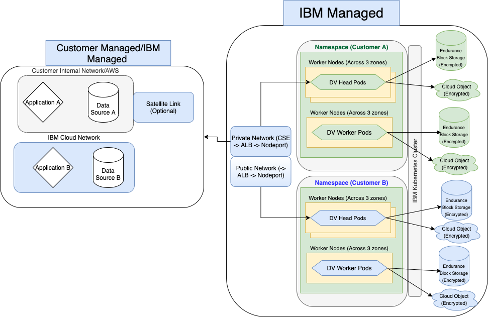

---

copyright:
  years: 2021, 2021
lastupdated: "2021-05-27"

keywords: public isolation for Data Virtualization, compute isolation for Data Virtualization, Data Virtualization architecture, workload isolation in Data Virtualization

subcollection: data-virtualization

---

<!-- Attribute definitions --> 
{:external: target="_blank" .external}
{:shortdesc: .shortdesc}
{:codeblock: .codeblock}
{:screen: .screen}
{:tip: .tip}
{:important: .important}
{:note: .note}
{:deprecated: .deprecated}
{:pre: .pre}

# Learning about Data Virtualization architecture and workload isolation
{: #compute-isolation}

Data Virtualization provides an architecture that isolates customer data and compute from other customers or other resources groups. It uses separate Kubernetes namespaces for each resource group you provision the service into, with seperate worker nodes for each of these namespaces. Each provisioned system also has separate encrypted block storage as well as seperate cloud object storage buckets.
{: shortdesc}

## Data Virtualization architecture
{: #architecture}

Review the following sample architecture for Data Virtualization, and learn more about different isolation levels so that you can choose the solution that best meets the requirements of the workloads that you want to run in the cloud.

{: caption="Figure 1. Sample Data Virtualization architecture {{site.data.keyword.dv_short}}" caption-side="bottom"}

## Data Virtualization workload isolation
{: #workload-isolation}

Enterprise Data Virtualization formations are provisioned on IBM Kubernetes Service clusters. Each formation is created in a customer specific namespace that is also specific to the resource group that that the formation is provisioned in. The pods that provide the Data Virtualization processing are isolated, running on worker nodes that are dedicated to the formation.

Each formation also includes a set of Block Storage devices that is encrypted with a Key Protect managed encryption key. You may also opt to use your own Key Protect managed keys.

Backups are stored in a customer specific encrypted cloud object storage bucket for at least 14 days.
