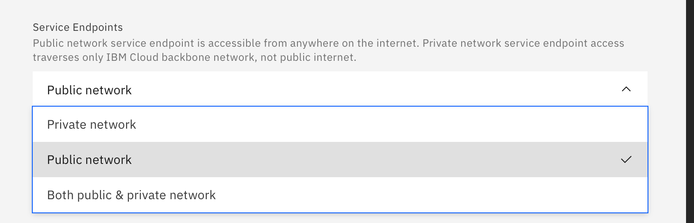
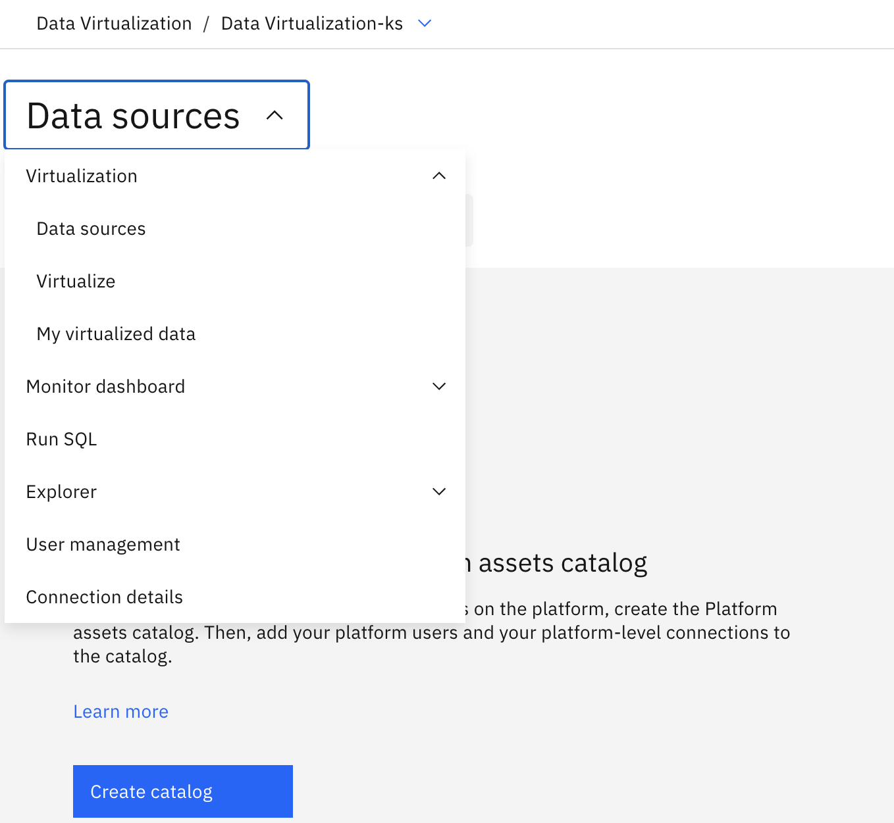
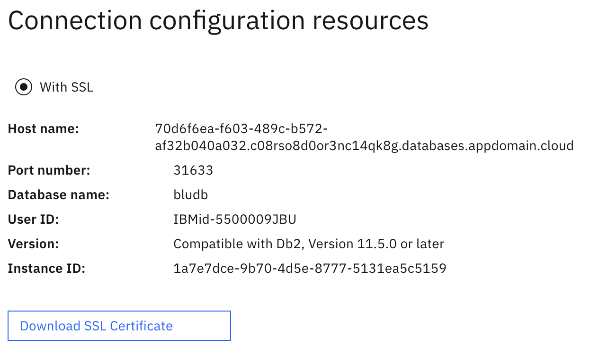

---

copyright:
  years: 2021, 2021
lastupdated: "2021-06-24"

keywords: 

subcollection: data-virtualization

---

<!-- Attribute definitions --> 
{:external: target="_blank" .external}
{:shortdesc: .shortdesc}
{:codeblock: .codeblock}
{:screen: .screen}
{:tip: .tip}
{:important: .important}
{:note: .note}
{:deprecated: .deprecated}
{:pre: .pre}

# Endpoints
{: #endpts}

## Enterprise plan
{: #ep_plans}

The Enterprise plan offers the choice of Public, Private, or both Public and Private endpoints.

- Public network service endpoint is accessible from anywhere on the internet. 
- Private network service endpoint access traverses only the {{site.data.keyword.cloud_notm}} backbone network, not the public internet.

### Instance creation
{: ep_inst_create}

At the time of instance creation, you can select your choice of endpoint from the **Service Endpoints** box on {{site.data.keyword.cloud_notm}}.

{: caption="Figure 1. Endpoint choice at instance creation" caption-side="bottom"}

### View endpoints
{: #ep_view_endpoints}

To view your endpoints:

- Select your {{site.data.keyword.dv_short}} service from {{site.data.keyword.cloud_notm}}.
- Select the **Data sources** dropdown menu. 

{: caption="Figure 2. Selecting the Connection details option" caption-side="bottom"}

- Select **Connection details**. Endpoint information will be displayed in **Connection configuration resources**.

{: caption="Figure 3. Viewing endpoint information" caption-side="bottom"}

