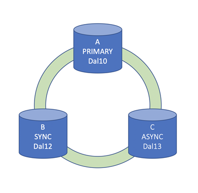
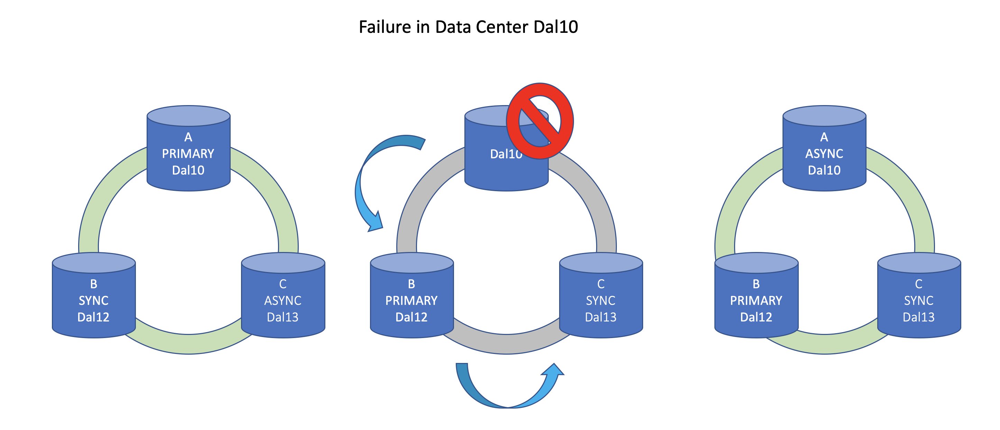

---

copyright:
  years: 2021, 2022
lastupdated: "2022-11-24"

keywords: HADR, Flex, high availability disaster recovery, bcdr, backups, restore

subcollection: data-virtualization

---

{:external: target="_blank" .external}
{:shortdesc: .shortdesc}
{:codeblock: .codeblock}
{:screen: .screen}
{:tip: .tip}
{:important: .important}
{:note: .note}
{:deprecated: .deprecated}
{:pre: .pre}

# High availability and Disaster Recovery (HA)
{: #ha}

{{site.data.keyword.dv_short}} plans have excellent availability characteristics with a 99.99% SLA. 
{: shortdesc}

High availability disaster recovery (HADR) on the {{site.data.keyword.dv_short}} Enterprise plan is provided by leveraging the support of native HADR replication. In addition to HADR for further redundancy, backups of the service are replicated across regions by default and are taken every 24 hours and saved for a minimum of 14 days. 

- Each HADR system consists of 3 nodes located in different independent availability zones within the same region.
- {{site.data.keyword.dv_short}} supports Dallas, Frankfurt, London and Tokyo regions.

{: caption="Figure 1. Schematic view of the 3 nodes in different availability zones" caption-side="bottom"}

- The primary node processes read and write transactions. One of the standby nodes is replicated synchronously, which means each transaction is committed on at least 2 nodes before it is successful and provides a recovery point objective of 0. This standby node is ready to take over write processing as well should any failure or maintenance event occur. The other standby node is asynchronously replicated and assumes the role of the synchronous node during a failure or maintenance event. Even in the case of an entire data center failure or maintenance event, you still have an HA system that is replicated between the surviving data centers.

{: caption="Figure 2. Schematic view of primary node failover" caption-side="bottom"}

- During failover events, you can expect between 10-20 seconds during which transactions are restricted. Your client can seamlessly fail over by using [automatic client reroute (ACR)](https://www.ibm.com/support/knowledgecenter/SSEPGG_11.5.0/com.ibm.db2.luw.admin.ha.doc/doc/r0023392.html){: external} along with appropriate retry logic for any failed transactions. It may take up to 5 minutes for all connections to be successful reestablished and processing.

- The failover is managed for you by IBM. IBM monitors the health of your server, fail over and fail back as needed, including rolling updates and scaling to keep uptime as high as possible.

- Backups are only used for restore by the service if a complete regional or service instance loss occurs without possibility of recovery. Backups are managed and restored by IBM personnel if needed. During situations where there is a complete loss of a service instance customer may be asked to provision a new service instance prior to the data being restored. 
